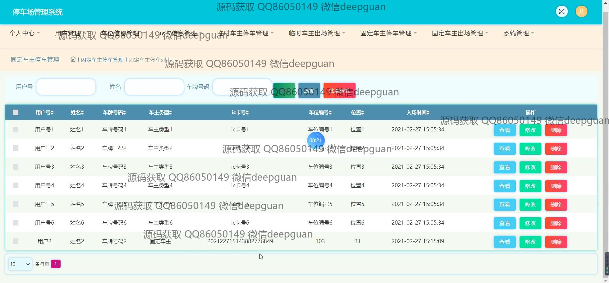

<h1 align="center">的停车场车位管理系统</h1>

## 简介
停车场车位管理系统：角色分为管理员、用户；功能包括登录注册、车位信息管理、用户管理、支付功能、实时车位监控、固定与临时车主停车管理。    --计算机毕业设计源码；毕设源码；java毕业设计源码

## 联系方式

<h3 align="center">获取完整代码与数据库文件 + 微信：deepguan QQ: 86050149 QQ群: 783742310</h3>

<h3 align="center">可帮忙远程部署 包运行成功！提供远程部署、修改代码、设计文档指导、代码讲解等服务！</h3>

## 功能介绍（完整见运行截图）
管理员：  
基本功能包括登录、注册、退出。网站首页提供主导航栏，支持个人中心、用户管理、车位信息管理、IC卡信息管理等模块。管理员可以添加或删除用户，编辑车位信息，分配车位，查询车辆状态，并对车主信息进行修改或删除操作。提供车位编辑功能，支持输入车位编号、位置、状态、停车价格以及备注，并可上传相关图片。系统支持通过用户号、姓名、车牌号码等条件筛选和管理临时车主及固定车主的停车信息。

用户：  
基本功能包括登录、注册、退出，以及个人信息的查看与修改。用户可在个人中心查看停车信息，注册时需填写邮箱、用户名、密码、车牌号码等信息，系统支持绑定IC卡。用户可通过系统查看车位状态、车辆进出时间及停车费用，并完成在线支付。系统提供详细的停车记录和出场信息，支持按车牌号码或用户名查询。

## 运行截图

本代码来源于网络,仅供学习参考使用!

